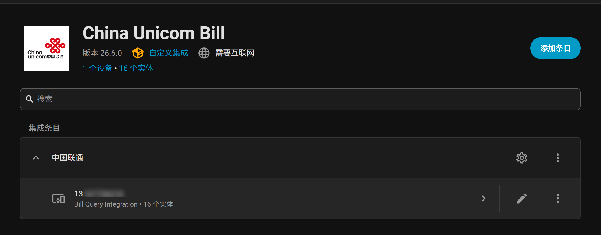
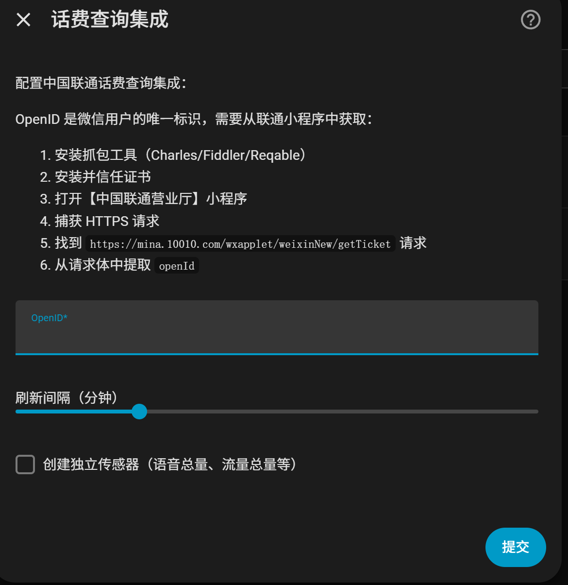
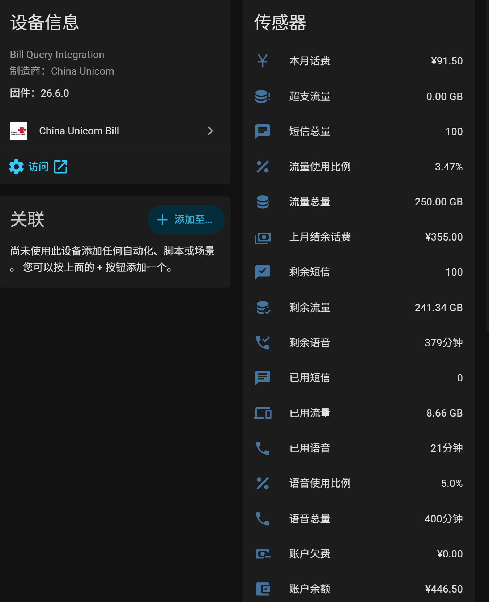
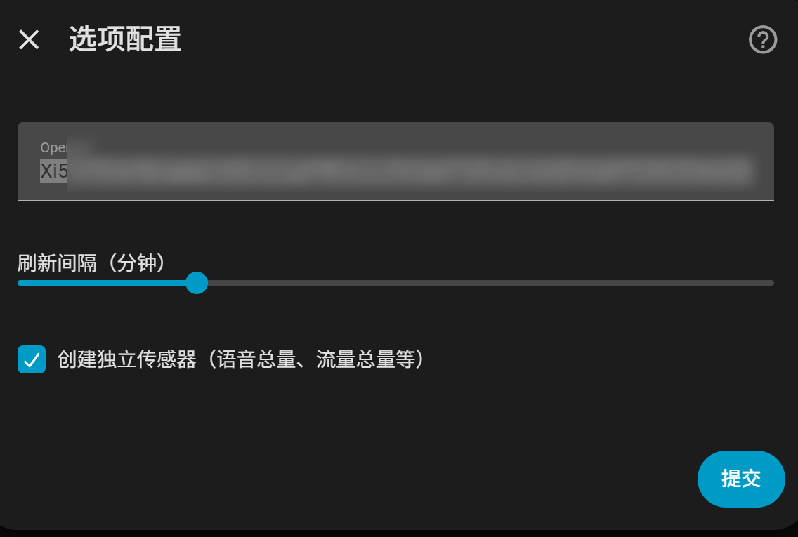

# 中国联通话费查询 (ha_unicom_bill)

[](https://github.com/hacs/integration)
[](https://GitHub.com/Cyborg2017/ha_unicom_bill/releases/)
[](LICENSE)

Home Assistant 自定义集成，用于查询中国联通话费、流量、语音等信息。



## ✨ 特性

- 📊 **16个传感器**：全面覆盖语音、短信、流量、余额信息
- 🔄 **自动更新**：可配置刷新间隔（1-60分钟）
- 🔐 **自动认证**：自动获取 ticket 和 Cookie，无需手动配置
- 🎨 **UI配置**：通过 Home Assistant 界面轻松配置
- 📱 **微信小程序**：基于联通微信小程序 API
- 🏗️ **模块化设计**：清晰的代码架构，易于维护和扩展

## 📦 安装

### 方法1: HACS（推荐）

1. 确保已安装 [HACS](https://hacs.xyz/)
2. 进入 HACS → 集成 → 点击右上角三个点 → 自定义仓库
3. 添加仓库：`https://github.com/Cyborg2017/ha_unicom_bill`
4. 分类选择：`Integration`
5. 点击"添加"
6. 搜索"China Unicom Bill"并安装
7. 重启 Home Assistant

### 方法2: 手动安装

1. 下载或克隆本仓库
2. 复制 `custom_components/ha_unicom_bill` 文件夹到 HA 的 `custom_components` 目录
3. 重启 Home Assistant
4. 在集成页面搜索"China Unicom Bill"并添加

## ⚙️ 配置

### 获取 OpenID

OpenID 是微信用户的唯一标识，需要从联通小程序中获取：

1. 安装抓包工具（Charles/Fiddler/Reqable）
2. 安装并信任证书
3. 打开【中国联通营业厅】小程序
4. 捕获 HTTPS 请求
5. 找到 `https://mina.10010.com/wxapplet/weixinNew/getTicket` 请求
6. 从请求体中提取 `openId`

### 配置步骤



1. 进入 Home Assistant → 设置 → 设备与服务
2. 点击右下角"添加集成"
3. 搜索"China Unicom Bill"
4. 填写配置表单：

| 字段 | 说明 | 必填 | 默认值 |
|------|------|------|--------|
| OpenID | 从抓包获取的 OpenID | 是 | - |
| 刷新间隔 | 数据更新频率（分钟） | 是 | 15 |
| 创建独立传感器 | 是否创建详细传感器 | 否 | 否 |

5. 点击"提交"完成配置

> **提示**: 手机号码将由系统自动从 API 获取，无需手动配置。

## 📊 可用传感器



### 基础传感器（始终创建）

| 翻译键 | 名称 | 单位 | 说明 |
|--------|------|------|------|
| `voice_usage` | 已用语音 | 分钟 | 已使用的语音时长 |
| `sms_usage` | 已用短信 | 条 | 已发送的短信数量 |
| `data_usage` | 已用流量 | GB | 已使用的流量 |
| `balance` | 账户余额 | 元 | 当前可用余额 |

**实体 ID 示例**: 
- 未配置手机号：`sensor.ha_unicom_bill_voice_usage`
- API 获取到完整号码后：
  - 设备名称：`手机号码 （例如：12345678900）`
  - 实体 ID：`sensor.unicom_12345678900_voice_usage`

> **提示**: 
> - 系统会自动从 API 获取**完整手机号码**
> - 设备名称直接显示手机号码：`例如：12345678900`
> - 实体 ID 使用手机号码：`例如：sensor.unicom_12345678900_voice_usage`

### 详细传感器（可选）

启用"创建独立传感器"后额外创建：

#### 语音传感器
- `voice_total` - 语音总量（分钟）
- `voice_available` - 剩余语音（分钟）
- `voice_ratio` - 语音使用比例（%）

#### 短信传感器
- `sms_total` - 短信总量（条）
- `sms_available` - 剩余短信（条）

#### 流量传感器
- `data_total` - 流量总量（GB）
- `data_available` - 剩余流量（GB）
- `data_exceed` - 超支流量（GB）
- `data_ratio` - 流量使用比例（%）

#### 账户传感器
- `real_fee` - 本月话费（元）
- `can_use_value` - 上月结余话费（元）
- `total_owed` - 账户欠费（元）

## 🔧 高级配置

### 修改配置



1. 进入 设置 → 设备与服务
2. 找到"China Unicom Bill"集成
3. 点击"配置"
4. 可以修改：
   - OpenID（如果过期需要更新）
   - 刷新间隔（1-60 分钟）
   - 是否创建详细传感器
5. 保存

### 调试日志

在 `configuration.yaml` 中启用调试日志：

```yaml
logger:
  default: info
  logs:
    custom_components.ha_unicom_bill: debug
```

## 🐛 故障排除

### OpenID 过期

**症状**：日志显示 `Authentication error` 或返回错误码 1001

**解决**：
- 重新抓包获取并输入新的 OpenID

### 数据不更新

**检查**：
1. 查看 Home Assistant 日志
2. 确认网络连接正常
3. 检查刷新间隔设置

## 📝 开发说明

### 项目结构

```
ha_unicom_bill/
├── __init__.py         # 集成入口
├── api.py              # API 客户端
├── config_flow.py      # 配置流程
├── const.py            # 常量定义
├── coordinator.py      # 数据协调器
├── manifest.json       # 集成元数据
├── sensor.py           # 传感器实体
└── translations/
    └── zh-Hans.json    # 中文翻译
```

### 添加新传感器

1. 在 `const.py` 中定义传感器常量
2. 在 `sensor.py` 中创建传感器类，继承 `UnicomBaseSensor`
3. 实现 `native_value` 属性
4. 在 `async_setup_entry` 中注册传感器

### API 端点

| API | 说明 |
|-----|------|
| `/weixinNew/getTicket` | 获取 ticket |
| `/wx/serviceEntrance` | 获取 microHall Cookie |
| `/weixinNew/sspbigball` | 获取概览数据 |
| `/balancenew/accountBalancenew.htm` | 获取余额详情 |
| `/queryOcsPackageFlowLeftContentRevisedInJune` | 获取用量详情 |

## 🤝 贡献

欢迎提交 Issue 和 Pull Request！

- Bug 报告：[Issues](https://github.com/Cyborg2017/ha_unicom_bill/issues)
- 功能建议：[Discussions](https://github.com/Cyborg2017/ha_unicom_bill/discussions)

## 📄 许可

本项目采用 GPL-3.0 许可 - 详见 [LICENSE](LICENSE) 文件

## 🙏 致谢

- 参考项目：[homeassistant-unicom_bill_info](https://github.com/hlhk2017/homeassistant-unicom_bill_info)
- 原始版本：homeassistant-unicom_bill_info v1.0.8
- Home Assistant 社区
